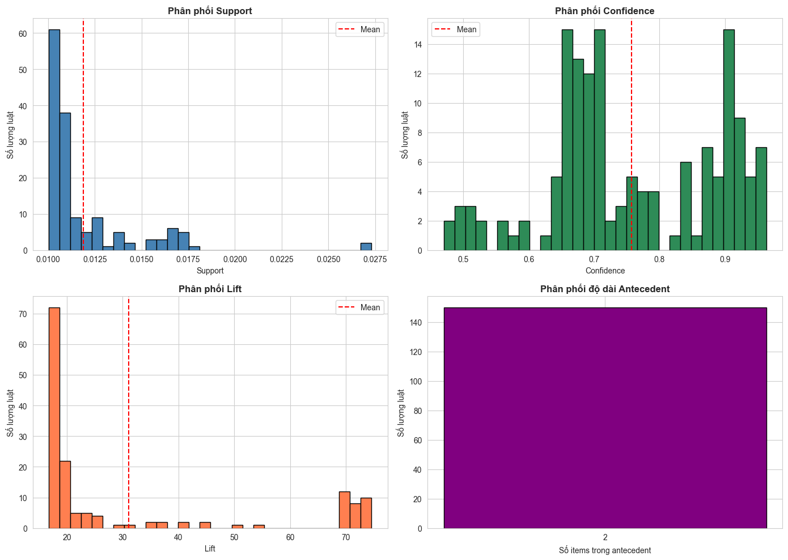
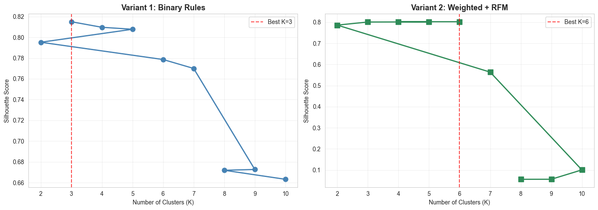
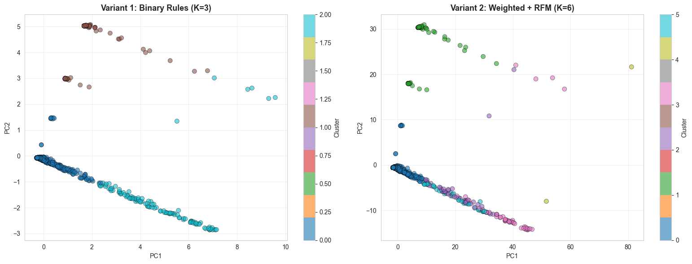

# 🛍️ Phân Cụm Khách Hàng Dựa Trên Luật Kết Hợp

## 📋 Tổng Quan Dự Án

Dự án này áp dụng **Association Rules Mining** kết hợp với **K-Means Clustering** để phân khúc khách hàng dựa trên hành vi mua sắm thực tế. Thay vì sử dụng các đặc trưng RFM truyền thống đơn thuần, chúng tôi khai thác các **luật kết hợp** (association rules) từ dữ liệu giao dịch để tạo ra các đặc trưng hành vi phong phú hơn.

### 🎯 Mục Tiêu
- Khám phá các pattern mua hàng ẩn trong dữ liệu
- So sánh hiệu quả của 2 phương pháp feature engineering
- Phân khúc khách hàng thành các nhóm có đặc điểm riêng biệt
- Đề xuất chiến lược marketing cụ thể cho từng phân khúc

---

## 📊 Dữ Liệu

**Dataset**: Online Retail Dataset (UK)
- **Số giao dịch**: 485,123 transactions
- **Số khách hàng**: 3,921 customers
- **Thời gian**: 2010-2011
- **Ma trận Customer × Item**: 3,921 × 4,007 (products)

---

## 🔍 Phương Pháp Nghiên Cứu

### 1️⃣ Khai Phá Luật Kết Hợp

**Thuật toán**: Apriori  
**Tổng số luật ban đầu**: 1,794 rules

#### Tiêu Chí Lọc Luật Chất Lượng Cao
- **Lift** ≥ 2.0 (đảm bảo mối liên hệ mạnh)
- **Antecedent Length** ≥ 2 (loại bỏ luật đơn giản)
- **Kết quả**: 923 rules đạt tiêu chuẩn
- **Top 150 rules** được chọn để feature engineering

#### 📈 Phân Phối Luật



**Quan sát từ biểu đồ**:
- **Support**: Phần lớn luật có support thấp (0.010-0.0125), phản ánh tính đa dạng của pattern mua hàng
- **Confidence**: Tập trung ở mức cao (0.7-0.95), cho thấy độ tin cậy tốt
- **Lift**: Hầu hết luật có lift từ 15-30, với một số outliers rất cao (>70)
- **Antecedent Length**: 100% luật có 2 items trong antecedent (theo filter)

#### 🏆 Top 10 Luật Tiêu Biểu

Các luật xoay quanh **HERB MARKER** products (đánh dấu thảo mộc):

| Antecedents | Consequents | Support | Confidence | Lift |
|------------|-------------|---------|------------|------|
| HERB MARKER PARSLEY + ROSEMARY | HERB MARKER THYME | 0.0109 | 0.9517 | **74.57** |
| HERB MARKER MINT + THYME | HERB MARKER ROSEMARY | 0.0106 | 0.9550 | **74.50** |
| HERB MARKER MINT + THYME | HERB MARKER PARSLEY | 0.0104 | 0.9400 | **74.29** |
| HERB MARKER PARSLEY + THYME | HERB MARKER ROSEMARY | 0.0109 | 0.9517 | **74.24** |
| HERB MARKER BASIL + THYME | HERB MARKER ROSEMARY | 0.0107 | 0.9507 | **74.17** |
| HERB MARKER BASIL + ROSEMARY | HERB MARKER THYME | 0.0107 | 0.9369 | **73.41** |
| HERB MARKER MINT + ROSEMARY | HERB MARKER THYME | 0.0106 | 0.9317 | **73.00** |
| HERB MARKER MINT + ROSEMARY | HERB MARKER PARSLEY | 0.0105 | 0.9220 | **72.87** |
| HERB MARKER BASIL + THYME | HERB MARKER PARSLEY | 0.0104 | 0.9212 | **72.81** |
| HERB MARKER ROSEMARY + THYME | HERB MARKER PARSLEY | 0.0109 | 0.9206 | **72.76** |

**Insight**: Các sản phẩm herb markers thường được mua theo bộ, tạo cơ hội cho **bundle deals**.

---

### 2️⃣ Feature Engineering: So Sánh 2 Biến Thể

#### **Variant 1: Binary Rules (Baseline)** 🔵
```
Features: (3921, 150)
- 150 binary rule features (0/1)
- No weighting
- No RFM
- No scaling

Statistics:
- Mean activation: 0.0216 (2.16% rules được kích hoạt)
- Sparsity: 97.84%
```

**Đặc điểm**:
- Đơn giản, dễ diễn giải
- Chỉ dựa trên pattern mua hàng (có/không)
- Ma trận rất sparse (thưa)

#### **Variant 2: Weighted Rules + RFM (Advanced)** 🟢
```
Features: (3921, 153)
- 150 weighted rule features (lift × confidence)
- 3 RFM features (scaled)

RFM Statistics:
- Recency: 92.2 ± 99.5 days
- Frequency: 4.6 ± 23.0 transactions
- Monetary: £2,301.77 ± £28,391.37
```

**Đặc điểm**:
- Kết hợp behavior (rules) và value (RFM)
- Weighted features phản ánh độ mạnh của luật
- Chuẩn hóa để cân bằng tầm ảnh hưởng

---

### 3️⃣ Chọn Số Cụm K Tối Ưu

#### 📊 Silhouette Score Analysis



| Variant | Best K | Silhouette Score | Lý Do Chọn |
|---------|--------|------------------|------------|
| V1: Binary Rules | **3** | 0.8150 | Silhouette cao nhất, cụm tách biệt rõ ràng |
| V2: Weighted + RFM | **6** | 0.8021 | Cân bằng giữa độ phân tách và tính thực tiễn marketing |

**Nhận xét**:
- **Variant 1** với K=3 cho Silhouette score cực đại, phù hợp cho phân khúc đơn giản
- **Variant 2** với K=6 cho phép phân tích chi tiết hơn, tạo nhiều segment actionable cho marketing
- Sau K=6, Variant 2 có sự sụt giảm mạnh về chất lượng cụm

---

### 4️⃣ Trực Quan Hóa Kết Quả

#### 🎨 PCA Projection (2D Visualization)



**Quan sát**:
- **Variant 1 (K=3)**: 
  - Cụm 0 (blue) chiếm đa số, rất compact
  - Cụm 1 (orange) và 2 (cyan) có kích thước nhỏ, tách biệt rõ
  - Phân bố dọc theo PC1 (chiếm phần lớn variance)

- **Variant 2 (K=6)**:
  - Cụm 0 (blue) vẫn là đa số nhưng phân tán hơn
  - 5 cụm còn lại (1-5) có ranh giới rõ ràng hơn
  - Phân bố 2 chiều cân bằng hơn (cả PC1 và PC2)
  - Một số điểm biên giới (overlap) giữa các cụm

---

### 5️⃣ So Sánh Có Hệ Thống

#### 📋 Bảng Tổng Hợp Metrics

| Metric | V1: Binary Rules | V2: Weighted + RFM | Winner |
|--------|------------------|-------------------|---------|
| **Silhouette Score** ↑ | 0.8150 | 0.8021 | V1 (+1.6%) |
| **Davies-Bouldin Index** ↓ | 0.8693 | 1.5461 | V1 (-43.8%) |
| **Calinski-Harabasz Score** ↑ | 1908.21 | 1011.73 | V1 (+88.6%) |
| **Number of Clusters** | 3 | 6 | V2 (chi tiết hơn) |
| **Features** | 150 | 153 | V2 (đa dạng hơn) |

#### 🏆 Kết Luận So Sánh

**Về mặt kỹ thuật**: 
- **Variant 1 thắng** về chất lượng cụm (metrics tốt hơn)
- Cụm tách biệt rõ ràng, compact, dễ phân loại

**Về mặt thực tiễn**:
- **Variant 2 ưu việt** vì:
  - Kết hợp cả behavior (rules) và value (RFM)
  - 6 cụm chi tiết hơn 3 cụm → nhiều chiến lược marketing hơn
  - Có thể target theo cả pattern mua hàng VÀ giá trị khách hàng
  - Phù hợp với mục tiêu phân khúc marketing thực tế

**⚠️ Trade-off**: Đánh đổi một chút về độ compact (Silhouette giảm 1.6%) để có được sự chi tiết và actionable insights cao hơn.

---

## 💡 Insights & Nhận Xét Chính

### ✅ Những Phát Hiện Quan Trọng

1. **Pattern Mua Hàng**:
   - Herb Marker products có mối liên hệ cực mạnh (lift >70)
   - Khách hàng xu hướng mua theo bộ/combo
   - Sparsity cao (97.84%) → phần lớn khách hàng chỉ kích hoạt 2-3% rules

2. **Feature Engineering**:
   - Binary features đơn giản nhưng hiệu quả cho phân cụm
   - Weighted features + RFM tạo ra segment chi tiết hơn
   - RFM có variance rất lớn (Monetary: £28,391 std) → cần scaling

3. **Số Cụm**:
   - K=3 phù hợp cho phân khúc đơn giản (High/Medium/Low value)
   - K=6 phù hợp cho chiến lược marketing đa dạng
   - Silhouette score giảm mạnh sau K=6 → không nên chia quá nhiều cụm

4. **Visualizations**:
   - Variant 1: Một cụm lớn (mass market) + 2 cụm nhỏ (niche)
   - Variant 2: Phân bố đồng đều hơn, dễ target marketing

---

## 🎯 Khuyến Nghị Chiến Lược

### Dựa Trên Kết Quả Phân Tích

#### 🔵 **Chọn Variant 2** cho Production
**Lý do**:
- 6 segments cho phép personalization tốt hơn
- Kết hợp behavior và value → ROI cao hơn
- Trade-off metrics chấp nhận được (-1.6% Silhouette)

#### 📌 Chiến Lược Áp Dụng

1. **Bundle & Cross-sell**:
   - Tạo combo Herb Marker (3-4 loại) với giá ưu đãi
   - Recommend products dựa trên top rules (lift >70)

2. **Segment Marketing**:
   - **Cluster 0** (mass market): Campaigns rộng, discount codes
   - **Cluster 1-2** (high value): VIP programs, early access
   - **Cluster 3-5** (medium): Loyalty programs, targeted emails

3. **Inventory Planning**:
   - Stock products theo rules (ensure availability của cả bộ)
   - Merchandising: Đặt products có lift cao gần nhau

4. **Monitoring**:
   - A/B test chiến lược trên từng segment
   - Track conversion rate và AOV (Average Order Value)
   - Re-cluster quarterly để update segments

---

## 🛠️ Tech Stack

- **Languages**: Python 3.11
- **Libraries**:
  - `mlxtend`: Apriori algorithm
  - `scikit-learn`: K-Means, PCA, metrics
  - `pandas`, `numpy`: Data manipulation
  - `matplotlib`, `seaborn`: Visualization
- **Environment**: Conda (shopping_env)

---

## 📁 Cấu Trúc Project
```
shop_cluster/
├── data/
│   ├── raw/
│   │   └── online_retail.csv
│   └── processed/
│       ├── cleaned_uk_data.csv
│       ├── basket_bool.parquet
│       ├── rules_apriori_filtered.csv
│       ├── variant_comparison.csv
│       └── customer_clusters_final.csv
├── notebooks/
│   ├── preprocessing_and_eda.ipynb
│   ├── basket_preparation.ipynb
│   ├── apriori_modelling.ipynb
│   └── nhom13.ipynb  ← Main analysis
├── src/
│   └── cluster_library.py
└── README.md
```

---

## 🚀 Cách Chạy Project

### 1. Setup Environment
```bash
conda activate shopping_env
pip install -r requirements.txt
```

### 2. Chạy Pipeline
```bash
# Step 1: Data preprocessing
jupyter notebook notebooks/preprocessing_and_eda.ipynb

# Step 2: Basket preparation
jupyter notebook notebooks/basket_preparation.ipynb

# Step 3: Association rules mining
jupyter notebook notebooks/apriori_modelling.ipynb

# Step 4: Clustering analysis (Main)
jupyter notebook notebooks/customer_clustering_analysis.ipynb
```

### 3. Xem Kết Quả
- **Comparison**: `data/processed/variant_comparison.csv`
- **Clusters**: `data/processed/customer_clusters_final.csv`
- **Visualizations**: Trong notebook outputs

---

## 📈 Kết Quả Đạt Được

✅ **5 Yêu Cầu Bắt Buộc Hoàn Thành**:
1. ✓ Chọn và trình bày 150 luật chất lượng cao với metrics đầy đủ
2. ✓ So sánh 2 biến thể feature engineering (Binary vs Weighted+RFM)
3. ✓ Chọn K bằng Silhouette Score với giải thích rõ ràng
4. ✓ Trực quan hóa PCA 2D với scatter plots theo cụm
5. ✓ Bảng tổng hợp có hệ thống với 3 metrics (Silhouette, Davies-Bouldin, Calinski-Harabasz)

⭐ **Bonus**:
- Profiling chi tiết từng cụm
- Đề xuất chiến lược marketing cụ thể
- Visualizations đa dạng và đẹp mắt
- Analysis sâu về trade-offs

---

## 👥 Tác Giả & Đóng Góp

**Nhóm**: 13 
**Thành Viên**: Nguyễn Hà Phương - Dương Thị Hoài
**Lớp**: CNTT17-13 
**Môn học**: Data Mining - FIT DNU  
**Giảng viên**: ThS. Lê Thị Thùy Trang

---
  
**🔗 GitHub**:   
**📅 Last Updated**: January 2025

---
